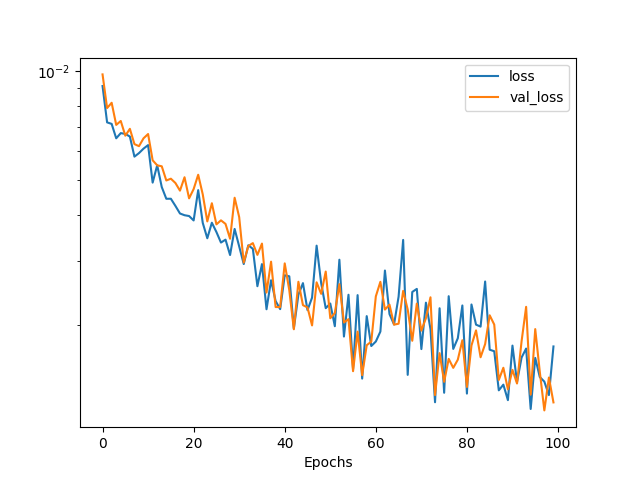

# An LSTM model implemented with PyTorch

This repo is to reproduce the GlueX tracking algorithm, which originally implemented with
 TensorFlow Keras [here](https://github.com/nathanwbrei/phasm/blob/main/python/2022.05.29_GlueX_tracking_v0.1.ipynb),
 with PyTorch, for a future integration with [phasm](https://github.com/nathanwbrei/phasm).

[The PyTorch code](./dev/Simplified_LSTM.py) is using the same LSTM network structure as listed below,
 where batch_size=1256 and seq_len=7.
The parameter counts of the layers are taken from the original Keras `model.summary()`.

| Layer   | Input size                 | Output size                  | Param # |
|:--------|:---------------------------|:-----------------------------|--------:|
| LSTM_1  | (batch_size, seq_len, 6)   | (batch_size, seq_len, 128)   |   69120 | 
| LSTM_2  | (batch_size, seq_len, 128) | (batch_size, seq_len, 64)    |   49408 |  
| LSTM_3  | (batch_size, seq_len, 64)  | (batch_size, 32)             |   12416 |
| Linear  | (batch_size, 32)           | (batch_size, 6)              |     198 |


#### Dataset
Download the dataset at the below address.

```commandline
wget https://halldweb.jlab.org/talks/ML_lunch/Sep2019/MLchallenge2_training.csv
mv MLchallenge2_training.csv train_data.csv

wget https://halldweb.jlab.org/talks/ML_lunch/Sep2019/MLchallenge2_testing_inputs.csv
mv MLchallenge2_testing_inputs.csv test_data.csv
```
As the dataset has changed after the Keras code's implementation, a 100%
 matched result is impossible.

After sequencing, the dimension of the whole training dataset is (2646573, 7, 6), with
 each epoch containing ~2108 batches. We train 100 epochs in total.

#### Early results
The code is tested with an `ifarm` RTX GPU. Some early results are available.
- [./res/training-loss](./res/training-loss): images of the losses along the training process.
- [./res/job-log](./res/job-log): the detailed job logs. An example of
 how losses are changed along the epochs, batches and time is [here](./res/job-log/lstm-farm-full.log).
- [./res/evaluation](./res/evaluation): images of the evaluation results.

#### TODO: 


- [ ] Currently, the code does not support adaptive learning rate adjustment, which is
 achieved by `callbacks=[reduce_lr, early_stopping]` in Keras `model.fit()`. As we can find
 in the above figure, for the larger epoch numbers, the loss does not converge well, which
 indicates that we should use smaller learning rate values.

---
### References
- Keras APIs: https://keras.io/api/
- PyTorch documentation: https://pytorch.org/docs/stable/index.html
- [From a LSTM cell to a Multilayer LSTM Network with PyTorch](https://towardsdatascience.com/from-a-lstm-cell-to-a-multilayer-lstm-network-with-pytorch-2899eb5696f3)


---
<div style="text-align: right"> Last updated on 09/29/2022 by xmei@jlab.org </div>